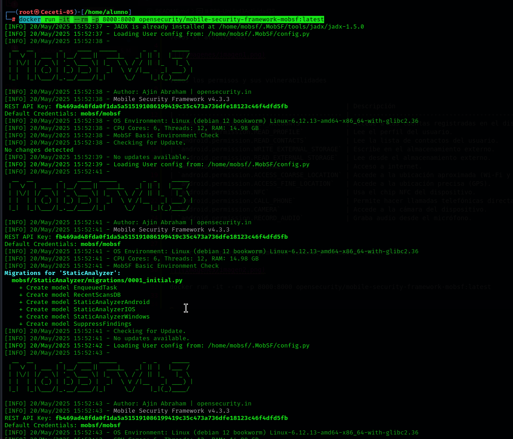

# PPS-Unidad3Actividad27

Vemos el archivo xml

Vemos los permisos y sus vulnerabilidades

| Permiso                                     | Descripción                                                   | Nivel de Riesgo |
| ------------------------------------------- | ------------------------------------------------------------- | --------------- |
| `android.permission.GET_ACCOUNTS`           | Accede a las cuentas registradas en el dispositivo.           | **Peligroso**   |
| `android.permission.READ_PROFILE`           | Lee el perfil del usuario.                                    | **Peligroso**   |
| `android.permission.READ_CONTACTS`          | Lee la lista de contactos del usuario.                        | **Peligroso**   |
| `android.permission.WRITE_EXTERNAL_STORAGE` | Escribe en el almacenamiento externo.                         | **Peligroso**   |
| `android.permission.READ_EXTERNAL_STORAGE`  | Lee desde el almacenamiento externo.                          | **Peligroso**   |
| `android.permission.INTERNET`               | Acceso a internet.                                            | **Normal**      |
| `android.permission.ACCESS_COARSE_LOCATION` | Accede a la ubicación aproximada (Wi-Fi y redes móviles).     | **Peligroso**   |
| `android.permission.ACCESS_FINE_LOCATION`   | Accede a la ubicación precisa (GPS).                          | **Peligroso**   |
| `android.permission.NFC`                    | Usa el chip NFC del dispositivo.                              | **Normal**      |
| `android.permission.CALL_PHONE`             | Permite hacer llamadas telefónicas directamente desde la app. | **Peligroso**   |
| `android.permission.CAMERA`                 | Accede a la cámara del dispositivo.                           | **Peligroso**   |
| `android.permission.RECORD_AUDIO`           | Graba audio desde el micrófono.                               | **Peligroso**   |

Levantamos el docker

docker pull opensecurity/mobile-security-framework-mobsf:latest

docker run -it --rm -p 8000:8000 opensecurity/mobile-security-framework-mobsf:latest

Entramos por el navegador y subimos nuestra apk

Y explortamos el report en 

